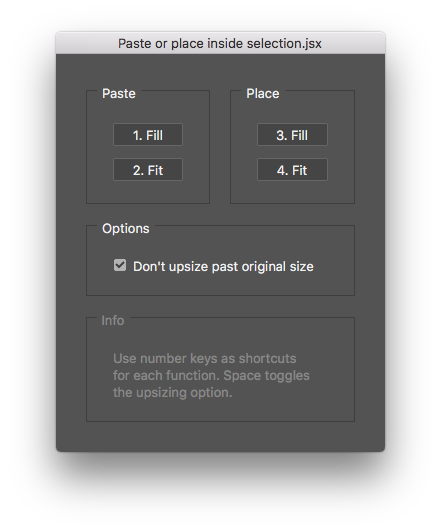

# Photoshop Script: Paste or Place Inside Selection.jsx

The scripts helps you paste or place images using fit and fill methods. Example gifs below [usage](#usage).

# Usage

You got 2 starting points...

1. **[Selection method (gif)](readme-images/selection-method.gif):** If you have an active marquee selection in the document, the image is placed inside the selection on a new layer.
2. **[Active layer method (gif)](readme-images/active-layer-method.gif):** If you don't have an active marquee selection, the image is placed in a new layer and placed in a clipping mask with the active layer.
    - If you want to place inside an existing clipping mask, you can select any layer that is part of that clipping mask. The new image will be placed on top of that stack.

Both of these gifs have an outdated dialog, but otherwise it works just the same. I should make new gifs...

## Known issues
- You can paste vector graphics from Illustrator, but it's rasterized on import.

## Good to know...
- Tested in PS CC 2020
- Added a new feature that shows the current layer size in percentages by appending it to the layer name.
    - The variable that controls this is called "changeLayerName"
    - Default value: "always"
    - Optional values: 'upsize prevented', 'never'
- You should definitely set a shortcut to launch this script or otherwise it'll be too difficult to use frequently.
- The old name was "Place Inside Selection.jsx".
